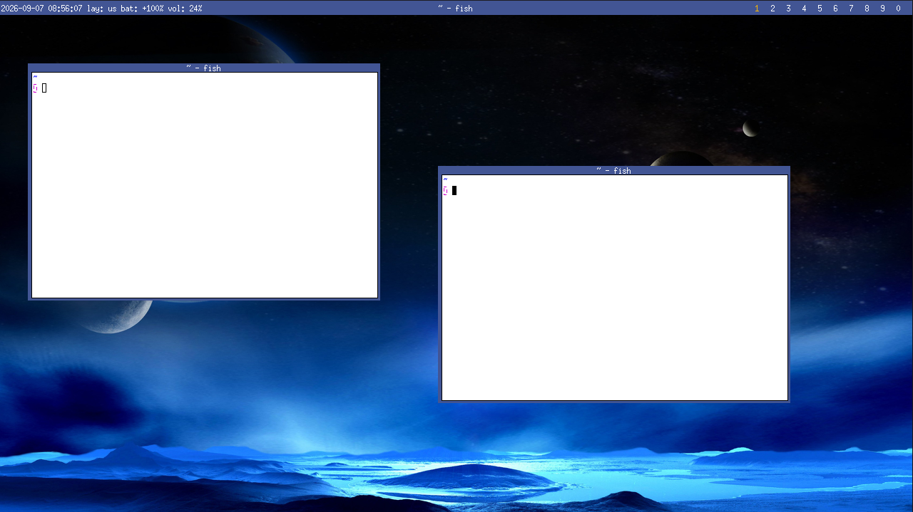

# bluewm

Bluewm is a small window manager with basic features; it comes with a
few basic applications such as a taskbar, a background, a clock and
an application launcher.



## OS supported

- Linux

## Dependencies

- [alsa-lib](https://github.com/alsa-project/alsa-lib)
- [libspng](https://github.com/randy408/libspng)
- [jpeg](https://github.com/libjpeg-turbo/libjpeg-turbo)
- libmath
- X11

## Build

```sh
./build.sh
```

## Test it

You must install `Xephyr` before running this command:

```
./scripts/test.sh
```

## License

Bluewm is licensed under a MIT license.
